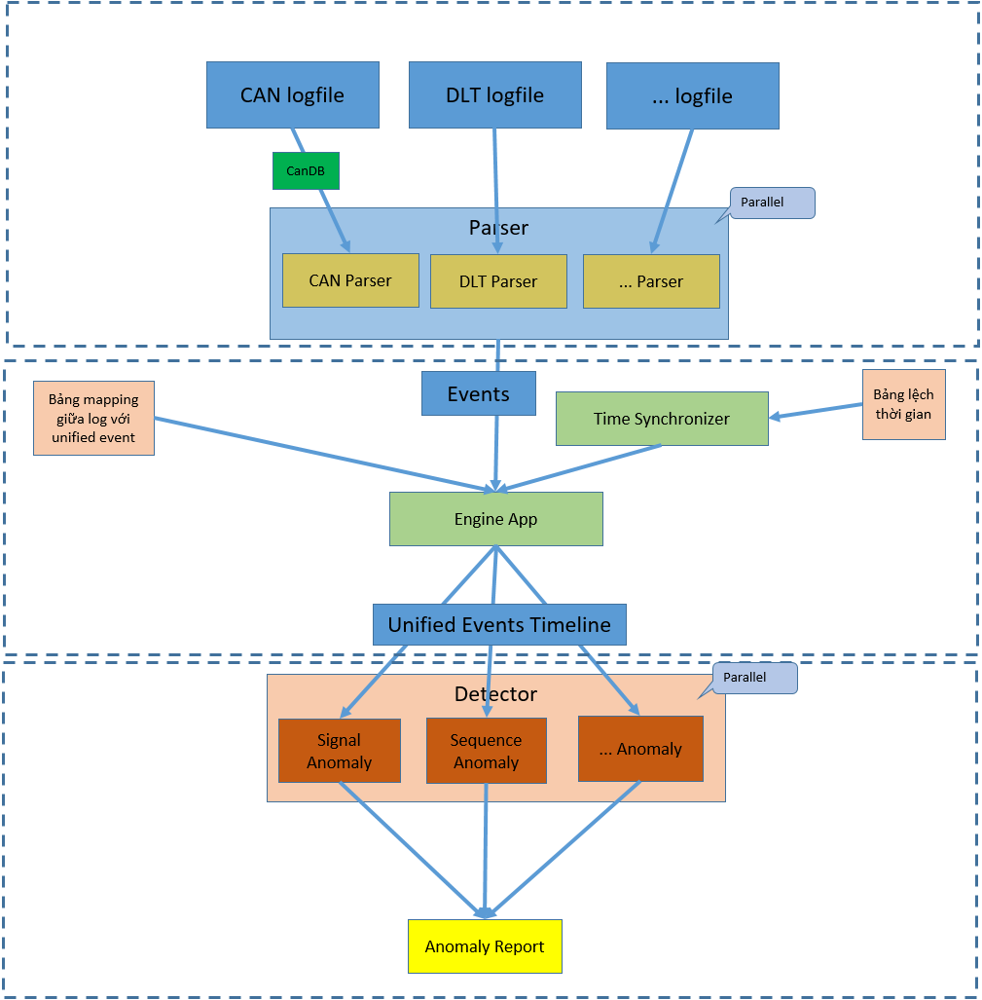

# Automotive Offline Log Analyzer

Hệ thống phân tích log ngoại tuyến dành cho ô tô (Automotive Offline Log Analyzer) là một công cụ mạnh mẽ giúp phát hiện các hiện tượng bất thường (anomalies) từ dữ liệu log đa nguồn như CAN bus, DLT (Diagnostic Log and Trace), MQTT và các dịch vụ Backend.

Dự án được thiết kế theo hướng module hóa cao, dễ dàng mở rộng để hỗ trợ các loại log mới hoặc các thuật toán phát hiện lỗi mới mà không cần sửa đổi mã nguồn cốt lõi.

---

## 1. Tính năng chính

- **Đồng bộ hóa thời gian (Time Synchronization)**: Tự động căn chỉnh mốc thời gian giữa các nguồn log khác nhau dựa trên cấu hình offset.
- **Chuyển đổi sự kiện thông minh (Event Mapping)**: Sử dụng Regex để bóc tách các payload phức tạp (đặc biệt là DLT) thành các thuộc tính Key-Value có cấu trúc.
- **Dòng thời gian hợp nhất (Unified Timeline)**: Gộp tất cả log vào một dòng thời gian duy nhất với cơ chế sắp xếp ổn định (Stable Sort) để bảo toàn thứ tự các sự kiện xảy ra đồng thời.
- **Phát hiện bất thường đa dạng**:
    - **Signal**: Vượt ngưỡng, nhảy vọt (spike), hoặc treo tín hiệu (freeze).
    - **Sequence**: Sai lệch trình tự trạng thái (FSM).
    - **Timing**: Mất gói tin hoặc jitter quá cao.
    - **Consistency**: Đối chiếu chéo giá trị giữa các nguồn (ví dụ: Tốc độ trên CAN vs Tốc độ trên DLT).
- **Xuất dữ liệu chuẩn hóa**: Xuất kết quả ra file `out_unified_log.json` định dạng NDJSON để dễ dàng quan sát và tích hợp với các công cụ khác.

---

## 2. Cấu trúc thư mục

- `data/`: Chứa các file log đầu vào và file cấu hình JSON. 
- `doc/`: File trình bày phân tích, kiến trúc app và demo [automotive-offline-log-analyzer.xlsx](doc/automotive-offline-log-analyzer.xlsx)
- `include/`: Các file header (.h).
- `src/`: Mã nguồn triển khai (.cpp).
- `third_party/`: Các thư viện bên thứ ba (ví dụ: `nlohmann/json`).

---

## 3. Hướng dẫn sử dụng

### Yêu cầu hệ thống
- C++ Compiler hỗ trợ C++17 trở lên.
- [CMake](https://cmake.org/) (phiên bản 3.14+).

### Biên dịch (Build)
```bash
mkdir build
cd build
cmake ..
cmake --build . --config Release
```

### Chạy ứng dụng

```bash
./log_analyzer ../data/
```

---

## 4. Dữ liệu đầu vào (Input Files)

Hệ thống tự động quét thư mục dữ liệu để tìm các file sau:

### File Log (.json)
- **`can_log.json`**: Chứa dữ liệu thô từ mạng CAN (ID, DLC, Data bytes).
- **`dlt_log.json`**: Log từ các ECU theo chuẩn AUTOSAR DLT (AppID, ContextID, Payload).
- **`mqtt_log.json`**: Dữ liệu từ các broker MQTT (Topic, Payload).
- **`backend_log.json`**: Nhật ký từ các dịch vụ cloud/server.

### File Cấu hình (.json)
- **`can_database.json`**: Định nghĩa cách giải mã các byte dữ liệu CAN thành các tín hiệu vật lý (như tốc độ, trạng thái cửa).
- **`anomaly_rules.json`**: File cấu hình trung tâm cho toàn bộ logic phân tích.

#### Chi tiết file `anomaly_rules.json`:
1.  **`time_offsets`**: Thiết lập độ lệch thời gian (giây) cho từng nguồn log để đồng bộ hóa về cùng một mốc thời gian thực.
2.  **`event_mappings`**: Định nghĩa các quy tắc trích xuất dữ liệu từ payload thô (Regex).
    - `source_type`: Nguồn log áp dụng (VD: DLT).
    - `filter`: Lọc theo AppID hoặc ContextID.
    - `payload_regex`: Biểu thức chính quy để bắt giá trị.
    - `regex_groups`: Tên các trường dữ liệu tương ứng với các nhóm bắt được trong Regex.
3.  **`signal_rules`**: Quy tắc kiểm tra tính chất vật lý của tín hiệu.
    - `min_value`/`max_value`: Giới hạn giá trị cho phép.
    - `spike_threshold`: Ngưỡng phát hiện thay đổi đột ngột giữa 2 sample.
    - `freeze_duration_s`: Thời gian tối đa tín hiệu được phép đứng yên một giá trị.
4.  **`sequence_rules`**: Kiểm tra logic nghiệp vụ dựa trên máy trạng thái (FSM).
    - `initial_state`: Trạng thái bắt đầu.
    - `transitions`: Các bước chuyển trạng thái hợp lệ kèm theo sự kiện kích hoạt (`trigger_event_type`) và điều kiện (`trigger_condition`).
5.  **`timing_rules`**: Kiểm tra tính thời gian của thông điệp.
    - `expected_period_s`: Chu kỳ mong muốn.
    - `max_jitter_s`: Độ lệch thời gian tối đa cho phép.
6.  **`consistency_rules`**: So sánh chéo dữ liệu giữa các nguồn khác nhau.
    - `source_a_type` / `source_b_type`: Hai nguồn cần đối chiếu (VD: CAN và MQTT).
    - `time_window_s`: Khoảng thời gian tối đa giữa 2 sự kiện để được coi là "cùng lúc".
    - `source_a_value_map`: Ánh xạ giá trị thô (VD: "0.000000") sang giá trị logic (VD: "locked").

---

## 5. Định hướng tương lai

- **Giao diện người dùng (GUI)**: Phát triển ứng dụng Desktop (sử dụng Qt hoặc Electron) để trực quan hóa dòng thời gian và các điểm xảy ra lỗi một cách trực quan trên biểu đồ.
- **Tối ưu hóa thuật toán**: Cải thiện hiệu năng các thuật toán so sánh chéo và khớp chuỗi sự kiện để xử lý các file log lớn (hàng triệu dòng) trong thời gian ngắn nhất.
- **Xử lý đa luồng (Multi-threading)**: Áp dụng song song hóa quá trình parse log và thực thi các Detector để tận dụng tối đa sức mạnh của CPU đa nhân.
- **Thêm cấu hình**: Thêm nhiều cấu hình option để có thể linh hoạt customize hơn.

---

## 6. Desgin

Dự án áp dụng các pattern tiên tiến để đảm bảo tính mở rộng:
- **Registry Pattern**: Quản lý các Parser. Thêm parser mới chỉ cần đăng ký vào registry mà không cần sửa core engine.
- **Factory Pattern**: Khởi tạo động các Detector từ file cấu hình JSON.
- **Singleton Pattern**: Đảm bảo các Registry và Factory được truy cập thống nhất.
- **Interface-based Design**: Các module giao tiếp qua các interface trừu tượng (`ILogParser`, `IAnomalyDetector`).


---

